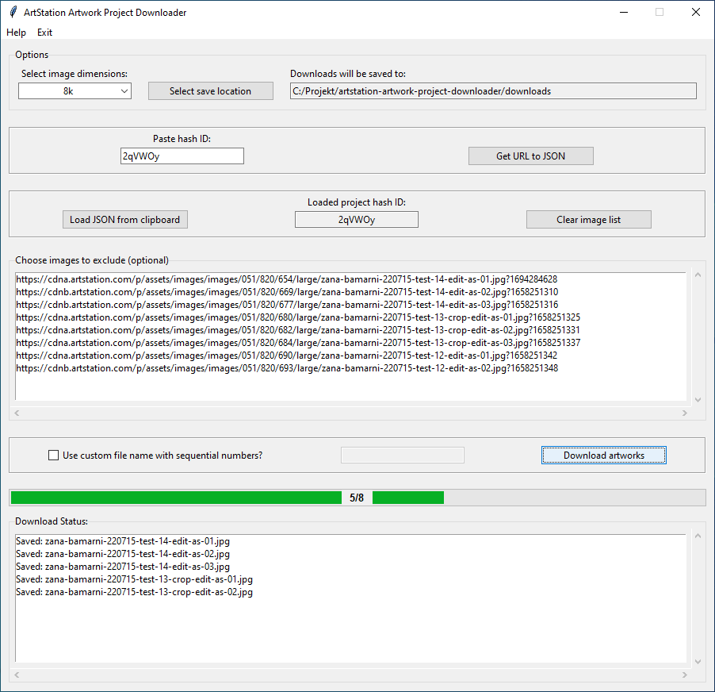

# ArtStation Artwork Project Downloader

## Overview
This is a simple Tkinter GUI application for downloading artwork projects from [ArtStation](https://www.artstation.com/). It was initially written as an exercise in webscraping and creating GUI applications with Tkinter.

While there exist other more sophisticated tools with support for many more image hosting sites (e.g. [gallery-dl](https://github.com/mikf/gallery-dl)), at the time of writing none allowed for the **selection of output image size** in an easy to use GUI application.

## Features

- Choose the image dimensions from the predefined list provided by ArtStation
- Get a list of artworks featured on a project page
- Exclude images from download by clicking on them
- Specify a custom file name (it will be numbered sequentially)
- Option to skip or rename a file if one with the same name already exists in the specified download directory
- Alternatively, skip the download of all files that already exist
- Download results will be displayed for each file

## How to use:

> [!WARNING]
> Repeated downloads of a large number of files in too short amount of time might cause you to be IP banned from ArtStation. Be careful not to overdo it!

1. Select image dimensions (small, medium, large, 4k, 8k)
1. Select target directory to download images to
1. Paste hash ID (found after artstation.com/artwork/*hashid*)
1. Load JSON data (use Fallback Method if an error is encountered)
1. (Optional) Select images that are to be excluded from download
1. (Optional) Enter a custom file name (files will be numbered sequentually)
1. Download images

> [!TIP]
> If `8k` is selected (the default setting), images will always be downloaded at the best possible quality and size, even if the actual image is not available at 8k.

## Installation
1. Clone the repository or download the zip file
2. Ensure that you have at least **Python 3.7** installed on your system
3. Navigate to the project directory in your command line interface (CLI) of choice
4. (Optional): create a virtual environment for the dependencies
5. Run `pip install -r /path/to/requirements.txt` to install required dependencies
6. Execute the main script using `python main.py`

## Potential future improvements
- Add image dimensions to the download log, not just file size
- Check if an already existing file differs in size from the file that is to be downloaded
- If desired, allow to overwrite existing files
- Should the project grow further, rework GUI layout

## Disclaimer
This program is intended for personal, non-profit use only and is not optimized for large-scale, high-volume scraping of files. Please source your data for training AI models ethically. Publicly available datasets for experimentation with machine learning and deep learning can be found on [Kaggle](https://www.kaggle.com/datasets).

## License
Released under [MIT](https://choosealicense.com/licenses/mit/) by
[@jrotzetter](https://github.com/jrotzetter)

This license means:

- You can freely copy, modify, distribute and reuse this software.
- The _original license_ and copyright notice must be included with copies of this software.
- Please _link back_ to this repo if you use a significant portion of the source code.
- The software is provided “as is”, without warranty of any kind.
